<div align="center">
  
  <h1>Backboard Assistant</h1>
  <p><strong>A modular Python-based AI Assistant backend powered by the Backboard SDK and FastAPI.</strong></p>
</div>

---

## 📖 Overview

The **Backboard Assistant** is a streamlined backend application designed to create and manage dynamic, conversational AI instances using the `backboard` Python SDK. Served via **FastAPI**, it allows clients to programmatically spin up assistants, spawn conversational threads, and inject messages seamlessly. 

This repository serves as an integration layer between your front-end applications and your AI services, establishing a standard flow for thread initialization and context continuity.

---

## 🏗️ System Architecture

The following sequence diagram outlines the end-to-end data flow when a user sends a message to the AI.

```mermaid
sequenceDiagram
    participant User as Client / User
    participant App as FastAPI Entrypoint
    participant Svc as BackboardService
    participant SDK as Backboard Client
    participant AI as AI Engine / LLM

    User->>App: POST /chat {message}
    App->>Svc: request chat initialization
    
    rect rgb(20, 30, 50)
    note right of Svc: Assistant SDK Orchestration
    Svc->>SDK: create_assistant("My First Assistant")
    SDK-->>Svc: returns assistant_id
    Svc->>SDK: create_thread(assistant_id)
    SDK-->>Svc: returns thread_id
    Svc->>SDK: send_message(thread_id, content)
    end
    
    SDK->>AI: execute prompt inside thread context
    AI-->>SDK: generation stream
    SDK-->>Svc: completion response
    Svc-->>App: string content
    App-->>User: JSON { response: "..." }
```



### Architecture Components
- **API (`api.py`)**: The FastAPI router handling HTTP traffic. It exposes a base endpoint and a `/chat` POST interface for asynchronous message passing.
- **Service (`backboard_service.py`)**: An abstraction layer that simplifies the `BackboardClient` SDK interface. It structures standard procedures (assistant generation over thread assignment).
- **Configuration (`config.py`)**: Handles the secure environment layer, fetching API keys seamlessly preventing accidental credential exposures.

---

## 🚀 Features

- **Asynchronous Stack**: End-to-end async implementation leveraging Python's `asyncio` and `FastAPI` to execute multiple non-blocking AI invocations concurrently.
- **Isolated Thread Context**: Every new chat initializes a separated thread bound directly to an assistant to ensure zero context bleeding across user interactions.
- **Modular Services**: The logic cleanly isolates API routing from core SDK operations, making it trivial to swap or modify LLM orchestrators downstream.

---

## 🛠️ Getting Started

### Prerequisites

You must have **Python 3.9+** and a valid access key for the Backboard API.

### Configuration

1. Clone this repository and ensure you are in the `backboard_assistant` project root.
2. Initialize your `.env` configuration file in `backboard.io_assistant/.env` mapping the following variables:
   ```env
   BACKBOARD_API_KEY=your_backboard_secret_key_here
   DEBUG=True
   ```
3. Create your virtual environment and install dependencies:
   ```bash
   cd backboard.io_assistant
   python -m venv venv
   source venv/bin/activate  # On Windows: .\venv\Scripts\activate
   pip install -r requirements.txt
   ```

### Execution

To run the application locally, you can use Uvicorn for asynchronous serving:

```bash
uvicorn api:app --reload
```
Navigate to `http://localhost:8000/docs` to test endpoints visually using FastAPI's built-in Swagger UI.

Alternately, to invoke the direct execution script demonstrating the system flow:
```bash
python app.py
```

---

## 🛡️ Best Practices & License

- **Key Management**: Never commit your `.env` keys. A `.gitignore` has been included correctly to omit these from version tracking.
- **Service Scalability**: In a production setting, threads should persist into a database structure instead of being spun up dynamically per request.
 
Contributions and issues are welcome as per standard opensource guidelines. Licensed appropriately under MIT terms.
